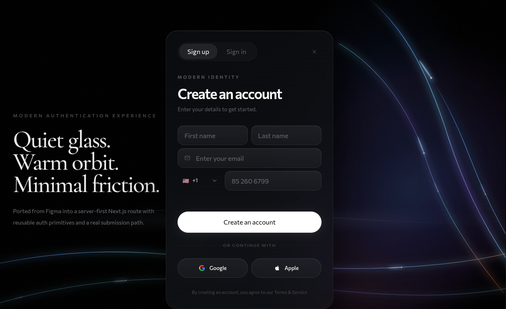

# Auth Experience



## Overview

Auth Experience is a modern authentication UI built as a premium web application surface. It focuses on a cinematic dark interface, refined glassmorphism, responsive layout, and subtle motion rather than backend authentication logic.

The interface was first explored and designed in Figma. The visual direction and refinement process were shaped with Claude Opus, and that design work was then implemented as a working Next.js application.

## Features

- Dual authentication states for sign up and sign in
- Premium cinematic background built with reusable SVG light trails
- Dark glassmorphism modal with refined transparency, blur, and layered highlights
- Responsive layout for desktop and smaller screens
- Styled form controls with polished focus states and dark autofill overrides
- International phone input with compact country selector, local-number entry, and submit-time normalization
- Bright high-contrast primary CTA and polished social auth button styles
- Reusable UI primitives for inputs, buttons, segmented controls, and background composition
- App Router-based structure with a minimal post-auth dashboard route

## Design And Style

The visual style is intentionally minimal, dark, and cinematic:

- A black background with layered luminous SVG trails and a subtle horizon glow
- A graphite-tinted glassmorphism modal with soft inner highlights
- Gentle motion designed to feel premium rather than decorative
- Clean modern typography and restrained spacing
- A UI direction translated from Figma design exploration into production-ready code

## Tech Stack

- Next.js 16 (App Router)
- React 19
- TypeScript
- Tailwind CSS 4
- CSS keyframe animations and inline SVG motion
- ESLint with `eslint-config-next`

Notes:

- Routing is handled with the Next.js App Router
- Motion is implemented with CSS and SVG, not with a dedicated animation library
- The current project is UI-focused and does not yet include a real authentication backend

## Implementation Notes

This project started as a design concept in Figma and was iterated visually before implementation. Claude Opus helped shape and refine the design direction, and the resulting UI was then built into a functioning application with reusable React components and a structured Next.js codebase.

The current implementation includes a working auth flow shell, form state transitions, a reusable premium background component, and server-side form handling for the demo experience.

## Getting Started

### Prerequisites

- Node.js 20+ recommended
- npm

### Install

```bash
npm install
```

### Run In Development

```bash
npm run dev
```

Open `http://localhost:3000` in your browser.

### Build For Production

```bash
npm run build
npm run start
```

### Lint

```bash
npm run lint
```

## Project Structure

```text
app/
  api/auth/social/route.ts     Minimal social-auth demo redirect route
  dashboard/page.tsx           Post-auth placeholder screen
  globals.css                  Global tokens, form styles, and shared animations
  layout.tsx                   Root layout
  page.tsx                     Main auth route

src/
  features/auth/
    actions/                   Auth-related server actions
    components/                Auth UI components
    model/                     Auth state types
  shared/ui/
    premium-login-background.tsx
                                Reusable cinematic SVG background
```

## Future Improvements

- Integrate a real authentication backend
- Add stronger client and server validation
- Replace demo social buttons with real provider integrations
- Improve accessibility coverage for keyboard flow, labels, and announcements
- Add automated UI tests for critical auth states
- Prepare the app for production deployment and environment-based configuration
